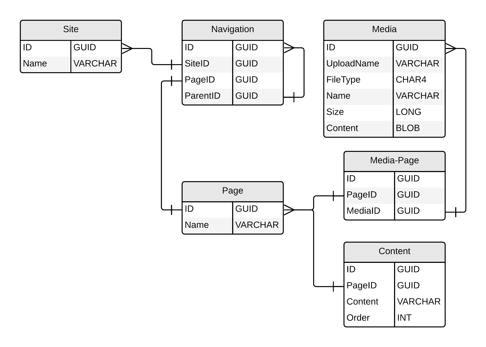
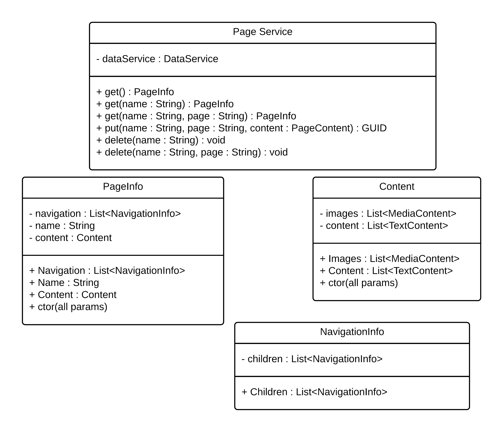

# Site Architecture

## Initial Database Structure
### Site
`Site` is a table that most items tie back to. The site consists of an ID, and a name. The name is the first segment in the URL.
### Navigation
The `Navigation` table ties pages to the site, and also defines the navigation structure for the page. `PageID` can be null, as can parent. A null `PageId` means that the navigation is not a link to a page, but only a parent. A null `ParentID` means that the navigation is a root-level item and should be displayed on the navigation bar
### Page
This table is to tie together pages of the site. The page has an `ID` and a `Name`. This `Name` is the second segment in the URL.
### Content
This table holds the textual content for the pages. The general use of this is to contain the content for `

` tags, but should contain content for any text-based tags. The `Order` is the order that the tags should be encountered in the page.
### Media
This table holds media. This includes pictures, videos, music, or any other media someone may want to showcase. The `UploadName` is the name of the file as it was uploaded, including name and file extension. `FileType` contans the extension, and `Name` includes the name (sans extension). `Size` is the size of the content, in bytes.
### MediaPage
This table is a many-many bridge table, allowing re-use of media across multiple pages.

___

## Initial PageService Class Diagram
### PageService
The `PageService` is a service that responds to requests for content. The returned structure describes navigation, and references to the content on the requested page. *The method parameters should be renamed in the class diagram*
#### get() : PageInfo
This method responds in the most generic way. Eventually we may implement this to return a searchable list of users for which sites may be found. Currently cannot really return anything because `name` is empty, so we don't know which user to access.
#### get(name : String) : PageInfo
This method responds with the default `page` for the given `user`.
#### get(name : String, page : String) PageInfo
This method responds with the given `page` for the given `user`.
#### put(name : String, page : String, content : PageContent) : GUID
This method "upserts" a `page`, creating it for the given `user` if it does not exist, or replacing the content if it does exist. The `GUID` of the page is returned on success.
#### delete(name : String) : void
Deletes all `page`s and all content associated with the given `user`
#### delete(name : String) : void
Deletes the given `page` and any unique content for the given `user`
### PageInfo
The `PageInfo` contains all the information for the front end about a `page`. The navigation information is contained in the root-level list, and each can contain children. The `name` is the given `name` of the page. `content` is the object containing the references to all the `content` needed to construct the page. As a data class, this contains no logic, just getters and setters.
### Content
The `Content` class contains the references to the images and text needed to construct the `page`.
### NavigationInfo
`NavigationInfo` contains the navigation information, including the `name` of each page that should be fetched if it's a link. *Correct this in the class diagram*
___